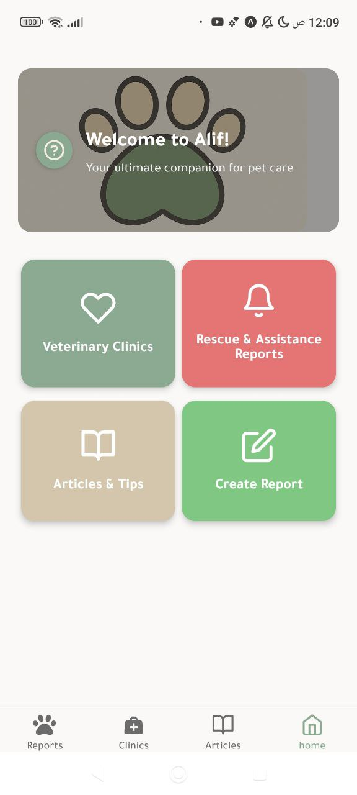
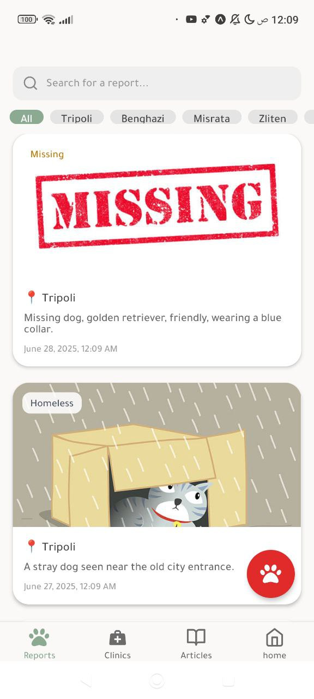
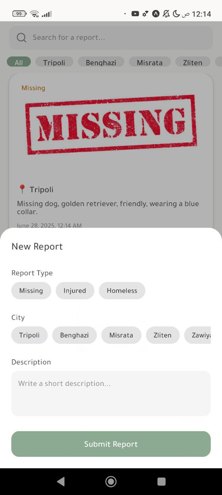
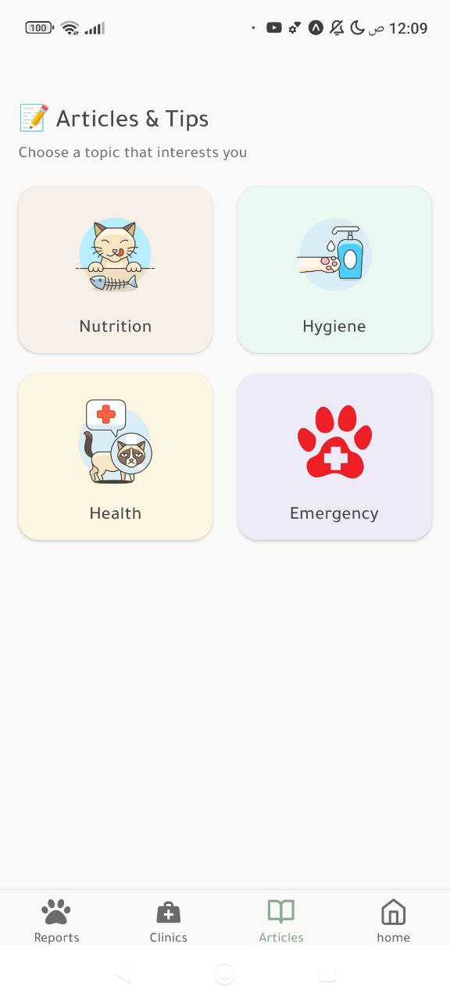
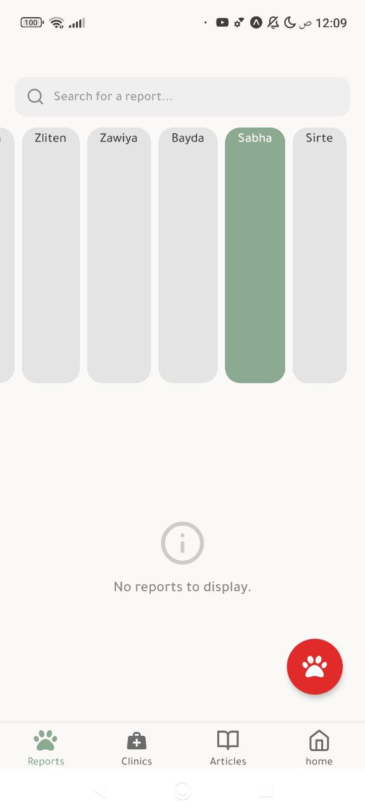
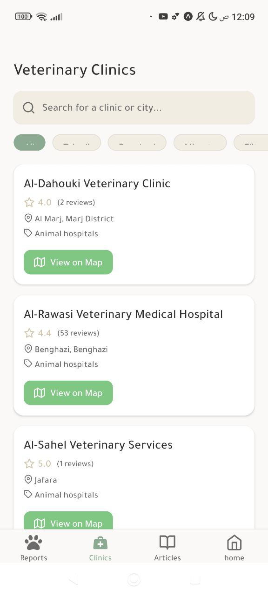
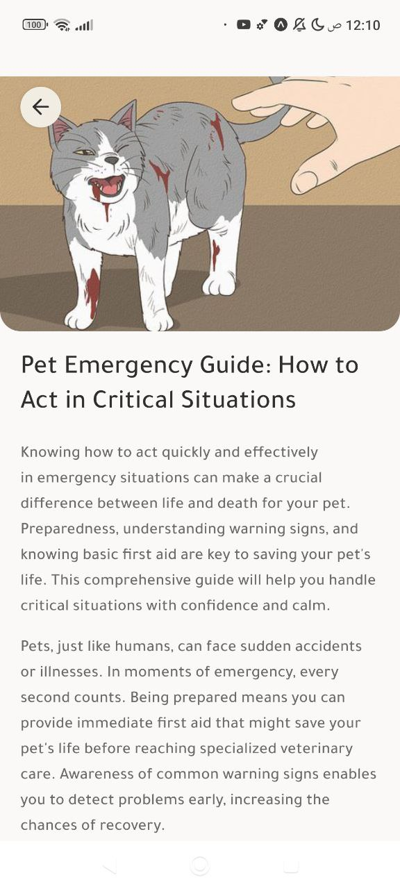
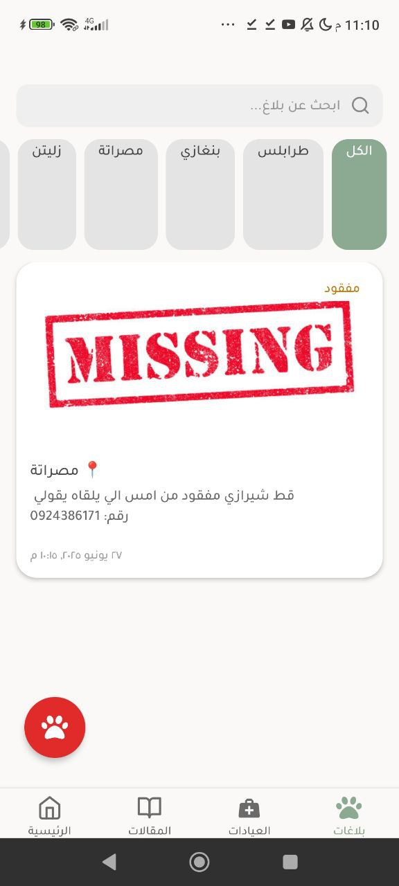

Alif

Alif is a mobile application designed to be a comprehensive guide for pet owners, providing essential information on pet hygiene, nutrition, general health, and emergency care. It also includes a directory of veterinary clinics and hospitals in Libya. Please note that this repository focuses on the User Interface (UI) of the application, which is designed to integrate seamlessly with a Supabase backend for all data management.

Alif (أليف, meaning 'Pet' or 'Domesticated' in Arabic) is a user-friendly mobile application built with React Native and Expo. It serves as an invaluable resource for pet owners, offering detailed articles and practical tips across various crucial aspects of pet care, with all content and data dynamically fetched from a Supabase database.

The app features:

    Hygiene Articles: Guides on regular bathing, fur cleaning, and nail trimming to prevent diseases and ensure comfort.

    Nutrition Articles: Comprehensive information on balanced diets, reading food labels, portion control, and avoiding harmful human foods.

    General Health Articles: Emphasizing the importance of regular vet visits, proper nutrition, physical activity, and maintaining a clean environment.

    Emergency Guide: A critical resource for handling pet emergencies, including common warning signs, essential first aid kit items, and tips for safe handling and transport of injured or sick pets. It also provides a quick way to contact emergency veterinary services.

    Veterinary Directory: A curated list of animal hospitals and veterinary clinics in Libya, complete with contact information (where available), ratings, and location details.

Alif aims to empower pet owners with the knowledge and tools they need to ensure the well-being and longevity of their beloved companions.
Getting Started

To get a local copy up and running, follow these simple steps.
Prerequisites

This project requires Node.js, npm/yarn, and Expo CLI installed globally. Full functionality of the application also depends on a properly configured Supabase backend.

    Node.js (LTS version recommended)

    npm or Yarn

    Expo CLI: npm install -g expo-cli or yarn global add expo-cli

    Supabase Project: An active Supabase project with your database schema set up to handle app data (articles, clinic details, etc.). You will need to configure your Supabase API URL and Anon Key within the application's environment variables (e.g., in a .env file or app.config.js).

Installation

    Clone the repo:

    git clone https://github.com/your_username/Alif.git

    Navigate into the project directory:

    cd Alif

    Install NPM packages:

    npm install
    # or
    yarn install

Running the Application

    Start the Expo development server:

    npx expo start

    Scan the QR code with your Expo Go app (iOS or Android) or choose to run on an iOS simulator, Android emulator, or web browser.

Usage

Navigate through the app using the tab bar at the bottom to access different categories of information (Hygiene, Nutrition, Health, Emergency). You can browse articles, view emergency contacts, and find veterinary services.
Contributing

Contributions are what make the open-source community such an amazing place to learn, inspire, and create. Any contributions you make are greatly appreciated.

If you have a suggestion that would make this better, please fork the repo and create a pull request. You can also simply open an issue with the tag "enhancement".
Don't forget to give the project a star! Thanks again!

    Fork the Project

    Create your Feature Branch (git checkout -b feature/AmazingFeature)

    Commit your Changes (git commit -m 'Add some AmazingFeature')

    Push to the Branch (git push origin feature/AmazingFeature)

    Open a Pull Request

Contact

MaedeDev - gmail : maededeveloper@gmail.com

## Application Screenshots

Here's a collection of images showcasing various screens within the application:

